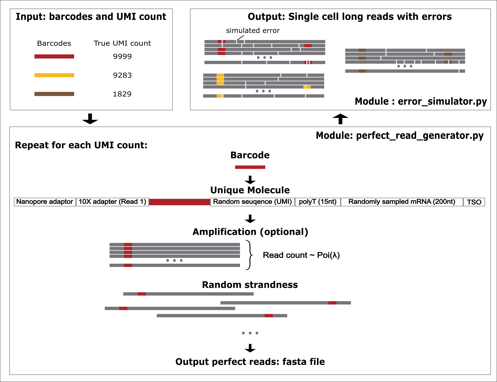

# Single-cell Long-read Simulator (SLSim)


## Dependency
* pandas
* numpy
* Biopython
* tqdm
* Badread (error_simulator.py)

#  Introduction


1. SLSsim randomly sample cDNA from transcript reference and attach 10x cell barcodes, UMI, poly(dT) and Template switching oligo (TSO) to form perfect reads (i.e. reads with no error.): `bin/perfect_read_generator.py`
2. SLSsim using the error model and qscore modle from Badread (one of the depencencies) to introduce error into the reads (`bin/error_simulator.py`). 

## Install
```
git clone https://github.com/youyupei/SLSim
cd SLSim
```

## Example code
1. Generate perfect reads (`template.fa`)
```
python3 bin/perfect_read_generator.py -r reference_transcript.fa -i bc_umi.csv -o template.fa
```
The output from `perfect_read_generator.py` is a FASTA file, each entry is an error-free read with the true barcode followed by a index as read id. 

2. Simulate nanopore errors and create fastq file
```
python3 bin/error_simulator.py -t template.fa
```
The output from `error_simulator.py` is a FASTQ file, each entry is a error-containing read with per-base quality score. The read id can be matched to those in the FASTA file generated from `perfect_read_generator.py`.


